# Lab 102 - Provision Audit and Alert Policies in Oracle Data Safe

- <a href='#Lab102-ProvisionAuditandAlertPoliciesinOracleDataSafe-BeforeYouBegin'>Before You Begin</a>

- <a href='#Lab102-ProvisionAuditandAlertPoliciesinOracleDataSafe-STEP1:ProvisionauditandalertpoliciesonatargetdatabasebyusingtheActivityAuditingwizard'>STEP 1: Provision audit and alert policies on a target database by using the Activity Auditing wizard</a>

- <a href='#Lab102-ProvisionAuditandAlertPoliciesinOracleDataSafe-STEP2:Viewdetailsforanaudittrail'>STEP 2: View details for an audit trail</a>

- <a href='#Lab102-ProvisionAuditandAlertPoliciesinOracleDataSafe-STEP3:Enableacustomauditpolicyonatargetdatabase'>STEP 3: Enable a custom audit policy on a target database</a>

<h2 id="Lab102-ProvisionAuditandAlertPoliciesinOracleDataSafe-BeforeYouBegin">Before You Begin

### Objectives

- Provision audit and alert policies on a target database by using the Activity Auditing wizard
- View details for an audit trail in Oracle Data Safe
- Enable a custom audit policy on a target database

### Requirements

To complete this lab, you need to have the following:

- Login credentials for the Oracle Data Safe Console
- An Oracle Data Safe service enabled in a region of your tenancy
- A registered target database in Oracle Data Safe with sample audit data. This labs uses an Autonomous Transaction Processing (ATP) database.

### Assumptions

This lab assumes that you are already signed in to the Oracle Data Safe Console. If not, see <a href="Lab-101---View-a-Registered-Target-Database-in-Oracle-Data-Safe.md">Lab 101 - View a Registered Target Database in Oracle Data Safe</a>, step 1 or 2.<h2 id="Lab102-ProvisionAuditandAlertPoliciesinOracleDataSafe-STEP1:ProvisionauditandalertpoliciesonatargetdatabasebyusingtheActivityAuditingwizard">**STEP 1**: Provision audit and alert policies on a target database by using the Activity Auditing wizard

- In the Oracle Data Safe Console, click the **Home** tab, and then click the **Activity Auditing** tab.

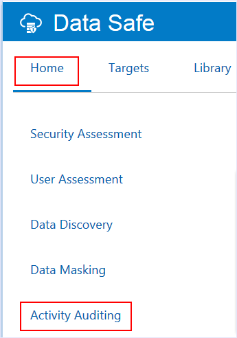

- On the **Select Targets for Auditing** page, select the check box for your target database, and then click **Continue**.

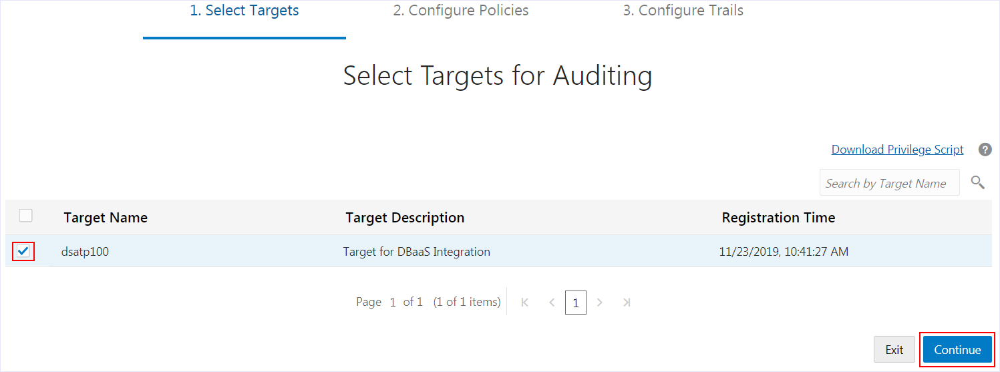

- On the **Retrieve Audit Policies** page, select the check box for your target database, and then click **Retrieve** to retrieve the audit policies for your database.

  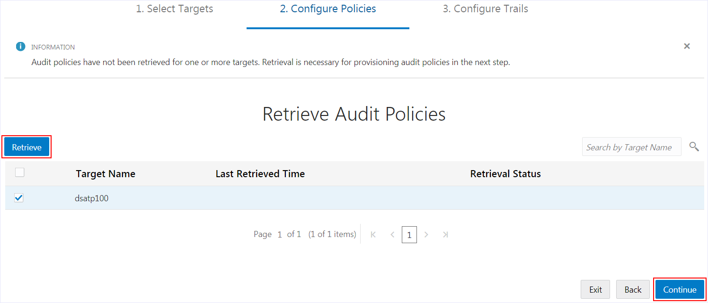

- Wait until a green check mark is displayed in the **Retrieval Status** column, and then click **Continue**.

  The check mark means that all of the audit policies are successfully retrieved.

  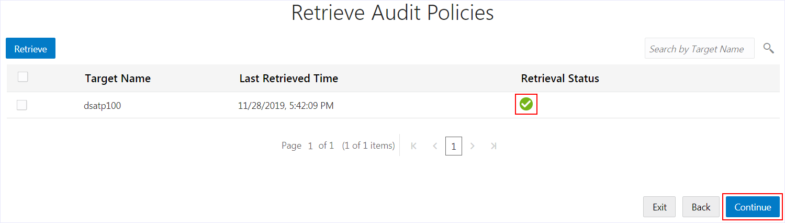

- On the **Review and Provision Audit and Alert Policies** page, review the types of audit policies already enabled on your target database, and then click your target database name to provision more policies.

  The check marks under **Additional Policies** and **Compliance Standards** mean that the Autonomous Transaction Processing (ATP) database has predefined audit policies and the Center for Internet Security (CIS) Configuration audit policy enabled.

  Currently, there are no basic, admin activity, or user activity audit policies provisioned on your database, nor are there any alert policies.

  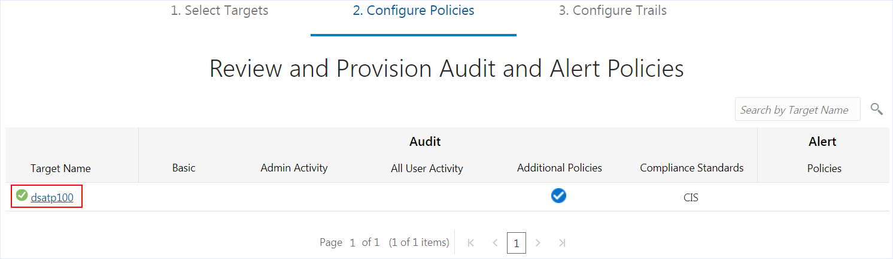

  

- On the **Audit Policies** tab in the **Edit Policies** dialog box, notice that the following **Basic Auditing** and **Admin Activity Auditing** policies are selected by default. Oracle recommends that you create and enable (provision) these policies. They are not provisioned by default.

  Critical Database Activity

  Login Events

  Database Schema Changes (DDL)

  Admin Activity

  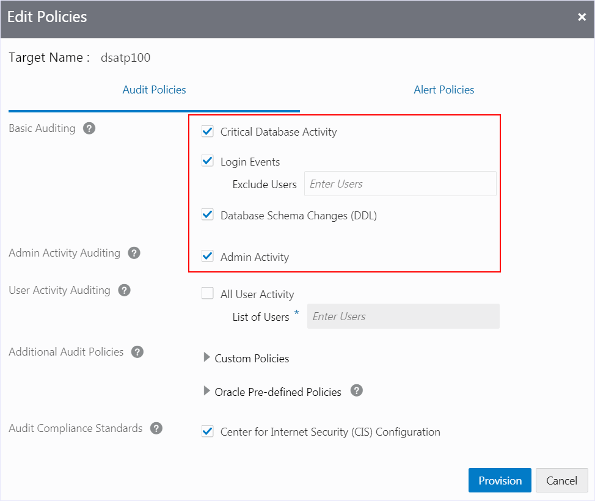

  

- Expand **Custom Policies**.

  If a custom policy is selected, it means that it is already created and enabled on your database. There are two such policies: <code>EMPSEARCH_SELECT_USAGE_BY_PETE</code> and <code>EMP_RECORD_CHANGES</code>. Note that <code>ADB_ADMIN_AUDIT</code> and <code>ADB_MANDATORY_AUDIT</code> are not custom policies. They are Oracle predefined policies for an Autonomous Database.

  If a custom policy is deselected, it means that you can select it to enable it on your database. There is one such policy: <code>APP_USER_NOT_APP_SERVER</code>.

  If a custom policy is selected, but greyed out, it means that the policy is already created and enabled on your database and is mandatory. There are two such policies on an ATP database: <code>COMMON_USER</code> and <code>SYS_USER_ACTIONS</code>.

  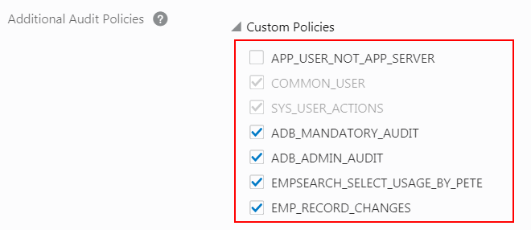

  

- Expand **Oracle Pre-defined Policies** to view the list of Oracle predefined audit policies available on your ATP database. By default, the following policies are provisioned:

  <code>ORA_ACCOUNT_MGMT</code>

  <code>ORA_DATABASE_PARAMETER</code>

  <code>ORA_SECURECONFIG</code>

  <code>ORA_DV_AUDPOL</code>

  <code>ORA_DV_AUDPOL2</code>

  <code>ORA_RAS_POLICY_MGMT</code>

  <code>ORA_RAS_SESSION_MGMT</code>

  <code>ORA_LOGON_FAILURES</code>

  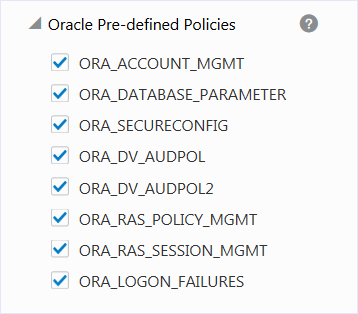

  

- Notice that the **Center for Internet Security (CIS) Configuration** policy is created and enabled by default.

  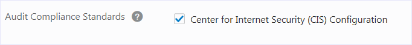

  

- Click the **Alert Policies** tab.

  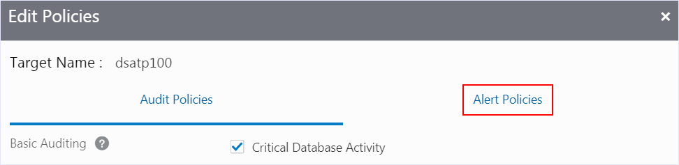

  

- Review the selected alert policies, and then click **Provision**. Oracle recommends that you provision all of these policies, which are as follows:

  Failed Logins by Admin User

  Audit Policy Changes

  Database Parameter Changes

  User Entitlement Changes

  User Creation/Deletion

  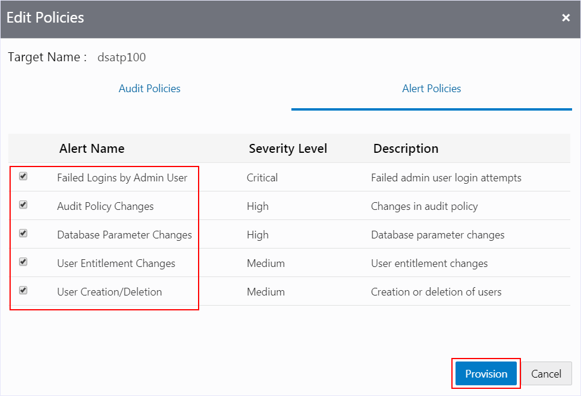

- On the **Review and Provision Audit and Alert Policies** page, wait for check marks to appear under all audit policy types, except for **All User Activity**, and then click **Continue**.

  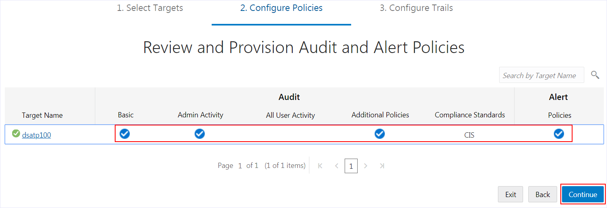

  

- On the **Start Audit Collection** page, notice the following defaults:

  The audit trail location is automatically set to <code>UNIFIED_AUDIT_TRAIL</code>.

  Audit collection is not yet started.

  The auto purge feature is enabled.

  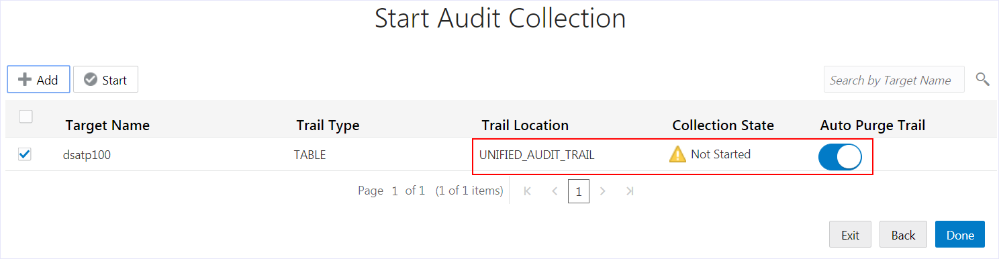

- Turn off the auto purge feature by sliding the **Auto Purge Trail** slider to the left.

  You need to turn off this feature if you want to keep the audit data on your target database.

  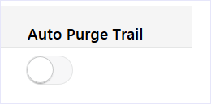

  

- Click **Start** to start collecting audit data.

  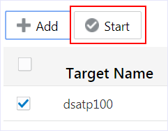

  

- A message at the top of the page states the <code>UNIFIED_AUDIT_TRAIL</code> is successfully created.

  The **Collection State** column indicates that collection is RUNNING, COLLECTING, and then IDLE.

  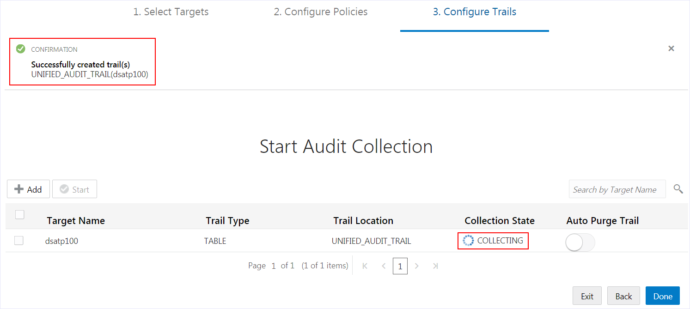

- While the audit data is being collected, click **Done**. You are directed to the **Audit Trails** page. 

  On the **Audit Trails** page, you can manage all of the audit trails for your target databases.

  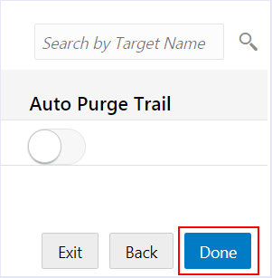

  <h2 id="Lab102-ProvisionAuditandAlertPoliciesinOracleDataSafe-STEP2:Viewdetailsforanaudittrail">**STEP 2**: View details for an audit trail

- In the **Collection State** column, click **COLLECTING** or **IDLE** if the audit data is collected.

  Collection takes approximately 2 minutes. You can continue to the next step.

  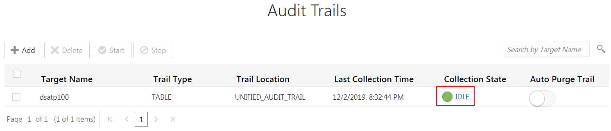

- In the **Trail Log** dialog box, review the logs, and then click **X** to close the dialog box.

  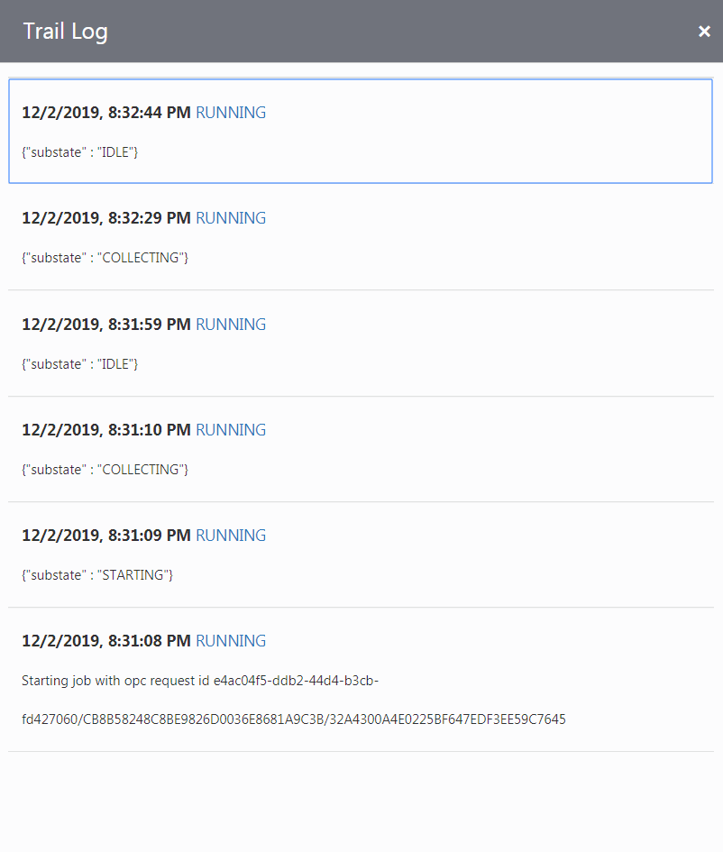

  <h2 id="Lab102-ProvisionAuditandAlertPoliciesinOracleDataSafe-STEP3:Enableacustomauditpolicyonatargetdatabase">**STEP 3**: Enable a custom audit policy on a target database

- Click the **Audit Policies** tab.

  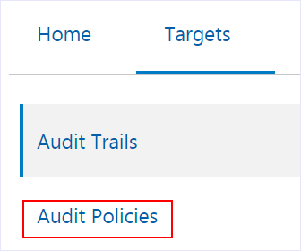

  

- On the **Review and Provision Audit and Alert Polices** page, click the name of your target database.

  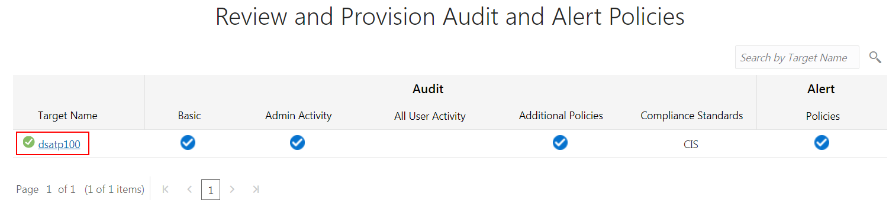

  

- In the **Edit Policies** dialog box, expand **Custom Policies**, select the <code>APP_USER_NOT_APP_SERVER</code> unified auditing policy to enable it, and then click **Provision**.

  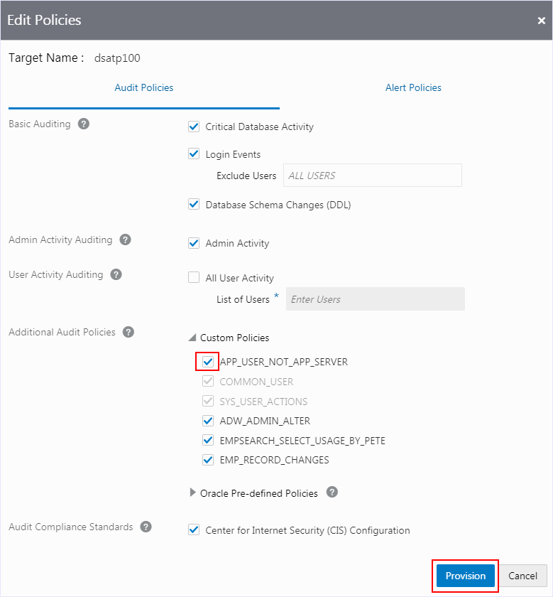

 

