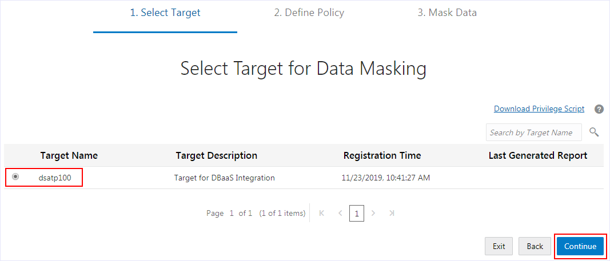

# Lab 105 - Discover and Mask Sensitive Data in Oracle Data Safe

- <a href='#Lab105-DiscoverandMaskSensitiveDatainOracleDataSafe-BeforeYouBegin'>Before You Begin</a>

- <a href='#Lab105-DiscoverandMaskSensitiveDatainOracleDataSafe-STEP1:ViewsensitivedatainyourATPdatabase'>STEP 1: View sensitive data in your ATP database</a>

- <a href='#Lab105-DiscoverandMaskSensitiveDatainOracleDataSafe-STEP2:DiscoversensitivedatabyusingDataDiscovery'>STEP 2: Discover sensitive data by using Data Discovery</a>

- <a href='#Lab105-DiscoverandMaskSensitiveDatainOracleDataSafe-STEP3:MasksensitivedatabyusingDataMasking'>STEP 3: Mask sensitive data by using Data Masking</a>

- <a href='#Lab105-DiscoverandMaskSensitiveDatainOracleDataSafe-STEP4:ValidatethemaskeddatainyourATPdatabase'>STEP 4: Validate the masked data in your ATP database</a>

<h2 id="Lab105-DiscoverandMaskSensitiveDatainOracleDataSafe-BeforeYouBegin">Before You Begin

### Objectives

- View sensitive data in your Autonomous Transaction Processing (ATP) database
- Discover sensitive data by using Data Discovery
- Mask sensitive data by using Data Masking
- Validate the masked data in your ATP database

### Requirements

To complete this lab, you need to have the following:

- Login credentials for the Oracle Data Safe Console
- An Oracle Data Safe service enabled in a region of your tenancy
- A registered target database in Oracle Data Safe with sample audit data and the password for the <code>ADMIN</code> user account
<h2 id="Lab105-DiscoverandMaskSensitiveDatainOracleDataSafe-STEP1:ViewsensitivedatainyourATPdatabase">**STEP 1**: View sensitive data in your ATP database

In this step, you use SQL Developer Web to query sensitive data in your ATP database. You can access SQL Developer Web in the ATP Console.

- In a new browser window, enter the url to your region in the Oracle Cloud Infrastructure Console.

  To access the Ashburn region, enter the following url:<a href="https://console.us-ashburn-1.oraclecloud.com/a/tenancy" rel="nofollow" class="external-link"><code> https://console.us-ashburn-1.oraclecloud.com.</code></a>

  To access the Frankfurt region, enter the following url:<a rel="nofollow" href="https://console.eu-frankfurt-1.oraclecloud.com/a/tenancy" class="external-link"><code> https://console.eu-frankfurt-1.oraclecloud.com.</code></a>

  

- If prompted, in the **Cloud Tenant** field on the **SIGN IN** page, enter your tenancy name, and then click **Continue**. Under **Oracle Cloud Infrastructure**, enter your user credentials for Oracle Cloud Infrastructure, and then click **Sign In**.

  Note: If you are signed in to Oracle Cloud Infrastructure on another tab, then you are not prompted to enter a tenancy name and can continue to the next step.

  

- Make sure the correct region is selected in your tenancy, for example, **US East (Ashburn)** or **Germany Central (Frankfurt)**.

  

  

- From the navigation menu, select **Autonomous Transaction Processing**.

  

- Under **COMPARTMENT**, make sure that your compartment is selected. For example, the <code>dsu100</code> user should be able to access the <code>dscrg100</code> compartment.

  

  

- In the list of databases, click the name of your database, for example, **dsatp100**.

  

  

- Click **Service Console** to navigate to the **Autonomous Transaction Processing Console**.

  A new browser tab is opened called **Autonomous Transaction Processing | Overview**.

  

  

- If the browser prevents you from opening a pop-up window, click **Options**, and then select **Allow pop-ups for console.us-ashburn-1.oraclecloud.com**.

  

- On the **Overview** page, click **Development**.

  

  

- Click **SQL Developer Web**.

  

  

- On the **SIGN IN** page for SQL Developer Web, enter the database credentials for the <code>ADMIN</code> user, and then click **Sign In**.

  You are provided the password during the lab.

  

  

- If a help note is displayed, you can click the **X** to close it.

  

  

- On the **Navigator** tab, select the <code>HCM1</code> schema from the first drop-down menu. In the second drop-down menu, ensure that **Tables** is selected.

  

  

- Drag the <code>EMPLOYEES</code> table to the worksheet.

  

  

- When prompted to choose an insertion type, click **Select**, and then click **Apply**.

  

  

- View the SQL query on the worksheet.

  

  

- On the toolbar, click the **Run Statement** button (green circle with a white arrow) to execute the query.

  

  

- Review the query results.

  Data such as <code>employee_id</code>, <code>first_name</code>, <code>last_name</code>, <code>email</code>, <code>phone_number</code>, <code>hire_date</code>, <code>job_id</code>, <code>salary</code>, and <code>manager_id</code> are considered sensitive data and should be masked if shared for non-production use, such as development and analytics.

  Keep this tab open so that you can return to it later in step 4 when you view the masked data.

  

  <h2 id="Lab105-DiscoverandMaskSensitiveDatainOracleDataSafe-STEP2:DiscoversensitivedatabyusingDataDiscovery">**STEP 2**: Discover sensitive data by using Data Discovery

The Data Discovery wizard generates a sensitive data model that contains sensitive columns in your target database. When working in the wizard, you select sensitive types that you want to discover in your target database.

- Open a new tab in your browser, and enter one of the following URLs to the Oracle Data Safe Console.

  The URL you use depends on your region. The url for the Ashburn region is <a rel="nofollow" href="https://datasafe.us-ashburn-1.oci.oraclecloud.com/ui/index.html" class="external-link"><code>https://datasafe.us-ashburn-1.oci.oraclecloud.com/ui/index.html.</code></a> The url for the Frankfurt region is <a rel="nofollow" href="https://datasafe.eu-frankfurt-1.oci.oraclecloud.com/ui/index.html" class="external-link"><code>https://datasafe.eu-frankfurt-1.oci.oraclecloud.com/ui/index.html.</code></a>

  

  Because you signed in to Oracle Cloud Infrastructure in step 1, you should automatically sign in. If not, sign in with your your tenancy name (if needed) and user credentials.

  

  The **Home** tab is displayed.

  

- Access the Data Discovery wizard by clicking the **Data Discovery** tab.

  

  

- On the **Select Target for Sensitive Data Discovery** page, select your target database, and then click **Continue**.

  

  

- On the **Select Sensitive Data Model** page, leave **Create** selected, enter **SDM1** for the name, enable **Show and save sample data**, select your resource group, and then click **Continue**.

  

  

- On the **Select Schemas for Sensitive Data Discovery** page, scroll down and select the **HCM1** schema, and then click **Continue**.

  

  

- On the **Select Sensitive Types for Sensitive Data Discovery** page, expand all of the categories by moving the slider to the right, and then scroll down the page and review the sensitive types. Notice that you can select individual sensitive types, sensitive categories, and all sensitive types.

  

  

- At the top of the page, select the **Select All** check box, and then click **Continue** to start the data discovery job.

  

  

- When the job is completed, ensure that the **Detail** column states <code>Data discovery job finished successfully</code>, and then click **Continue**.

  

  

- On the **Sensitive Data Discovery Result** page, examine the sensitive data model created by the Data Discovery wizard. To view all of the sensitive columns, move the **Expand All** slider to the right.

  Oracle Data Safe automatically saves your sensitive data model to the Oracle Data Safe Library.

  

- From the drop-down list, select **Schema View** to sort the sensitive columns by table.

  

  

- Scroll down the page to view the sensitive columns.

  You can view sample data (if it's available for a sensitive column), column counts, and estimated data counts.

  In particular, take a look at the sensitive columns that Data Discovery found in the <code>EMPLOYEES</code> table. Columns that do not have a check mark are called referential relationships. They are included because they have a relationship to another sensitive column and that relationship is defined in the database's data dictionary.

  Also view the sample data provided to get an idea of what the sensitive data looks like. Your sample data may be different.

  

- Scroll to the bottom of the page, and then click **Report** to view the Data Discovery report.

  The chart compares sensitive categories. You can view totals of sensitive values, sensitive types, sensitive tables, and sensitive columns.

  The table displays individual sensitive column names, sample data for the sensitive columns, column counts based on sensitive categories, and estimated data counts.

  

- Click the chart's **Expand** button.

  

  

- Position your mouse over **Identification Info** to view statistics.

  

  

- With your mouse still over **Identification Info**, click the **Expand** button to drill down.

  

  

- Notice that the **Identification Info** category is divided into two smaller categories (**Personal IDs** and **Public IDs**). To drill-up, position your mouse over an expanded sensitive category, and then click the **Collapse** button.

  

  

- Click the **Close** button (**X**) to close the expanded chart. Continue to work in the wizard.

  

  <h2 id="Lab105-DiscoverandMaskSensitiveDatainOracleDataSafe-STEP3:MasksensitivedatabyusingDataMasking">**STEP 3**: Mask sensitive data by using Data Masking

The Data Masking wizard generates a masking policy for your target database based on a sensitive data model. In the wizard, you select the sensitive columns that you want to mask and the masking formats to use.

- Click **Continue to mask the data**. The Data Masking wizard is displayed.

  

  

- On the **Select Target for Data Masking** page, your target database is selected. Click **Continue**.

  

  

- On the **Masking Policy** page, move the **Expand All** slider to the right to view all of the sensitive columns. Scroll down the page to view the default masking format selected for each sensitive column.

  

  

- For the <code>HCM1.LOCATIONS.STREET_ADDRESS</code> column, click the arrow to the right of the masking format to view other masking formats.

  

  

- Next to the arrow, click the **Edit Format** button (pencil icon).

  

  

- In the **Edit Format** dialog box, view the description, examples, and default configuration for the masking format.

  This is where you can modify a masking format. Click **Cancel**.

  

  

- At the bottom of the page, click **Confirm Policy**, and then wait a moment while Data Masking creates the masking policy.

  

  

- On the **Schedule the Masking Job** page, leave **Right Now** selected, and then click **Review**.

  

  

- On the **Review and Submit** page, review the information, and then click **Submit** to start the data masking job.

  

  

- Wait for the data masking job to finish. It takes a couple of minutes. You can follow the status of the job on the **Masking Jobs** page. When the job is finished, click **Report**.

  

  

- Examine the **Data Masking** report.

  At the top of the report, you can view the number of values, sensitive types, tables, and columns that were masked.

  The table shows you column counts for the sensitive categories and types. For each sensitive column, you can view the masking format used and the number of rows masked.

  

- Click **Generate Report**.

  

  

- In the **Generate Report** dialog box, leave **PDF** selected, enter **Mask1_HCM1** for the description, ensure your resource group is selected, and then click **Generate Report**.

  

  

- Wait for the report to generate. When it's generated, click **Download Report**.

  

  

- Access the browser's downloads and open the report in Adobe Acrobat. Review the report, and then close it.

  

  <h2 id="Lab105-DiscoverandMaskSensitiveDatainOracleDataSafe-STEP4:ValidatethemaskeddatainyourATPdatabase">**STEP 4**: Validate the masked data in your ATP database

- Return to the browser tab for **SQL Developer Web**. You should still have your query results from STEP 1 in this lab. Take a moment to review the data.

  

  

- On the toolbar, click the **Run Statement** button (green circle with a white arrow) to execute the query.

  

  

- If a dialog box is displayed stating that your session has expired, click **OK**, sign in again, and then click the **Run Statement** button.

  

  

- Review the masked data.

  You can resize the panel to view more data, and you can scroll down and to the right.

  

 

